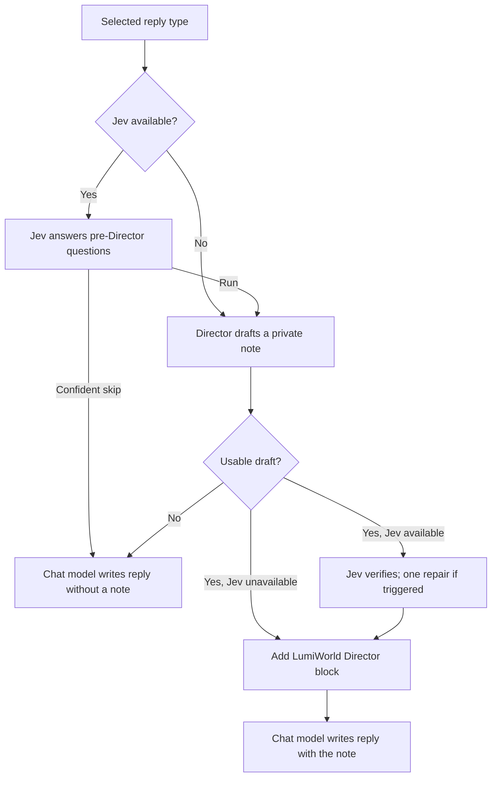

<div align="center">

# LumiWorld

**A private Director for your next Lumiverse reply.**

[](./spindle.json)
[](https://github.com/prolix-oc/Lumiverse)
[](./LICENSE.md)

*Give the world a reason to move forward.*

</div>

LumiWorld prepares a short piece of direction before the main model writes its next reply. It considers the recent conversation and the context you enable, then suggests how the environment, NPCs, consequences, or hidden pressures should develop.

The resulting note is added to the main model’s prompt. Your chat model still writes the scene.

**Version 0.5.0-experimental adds Jev**, an optional structured decision model. Jev answers fixed-choice questions before and after the Director writes its note. Some answers control whether and how the Director runs; others guide its writing or appear only in diagnostics. [The decision guide](#jev-decisions) spells out the difference. The floating widget and World Agent simulation remain removed.

Jev is opt-in. With no Jev connection configured, LumiWorld behaves exactly as the Director-only baseline.

> **Private means prompt context:** Director notes are intended to stay out of the visible story. They are sent to the selected models and can be inspected in Prompt Breakdown. This is not an encryption or secrecy guarantee.

---

## Table of contents

- [At a glance](#at-a-glance)
- [How it works](#how-it-works)
- [Compatibility](#compatibility)
- [Installation](#installation)
- [Quick start](#quick-start)
- [Jev decisions](#jev-decisions)
- [All 36 decisions](#all-36-decisions)
- [The drawer](#the-drawer)
- [Settings reference](#settings-reference)
- [Prompt templates](#prompt-templates)
- [Testing and Prompt Breakdown](#testing-and-prompt-breakdown)
- [Generation time and usage](#generation-time-and-usage)
- [Permissions](#permissions)
- [Privacy and storage](#privacy-and-storage)
- [Upgrading](#upgrading)
- [Troubleshooting](#troubleshooting)
- [Development](#development)
- [License](#license)

---

## At a glance

| Feature | What it does |
|---|---|
| **Direction before each reply** | Prepares a fresh note about what should change, how NPCs should respond, and what should remain unresolved. |
| **Your choice of model** | Uses a saved Lumiverse connection with an optional model override. |
| **Selective triggers** | Runs before new replies, continuations, regenerations, swipes, and impersonations only when selected. |
| **Context controls** | Includes recent chat history plus optional character, persona, and activated World Info context. |
| **Private guidance** | Accepts your own notes for the Director without adding them as a visible chat message. |
| **One drawer** | Keeps setup and everyday controls together, with notes and advanced settings expandable in place. |
| **Automatic saving** | Saves edits as you make them and retains the draft for retry if a save fails. |
| **Inspectable output** | Attributes the injected system block as **LumiWorld Director** in Prompt Breakdown. |
| **Graceful failure** | Continues the normal generation without a Director note if the Director fails or times out. |
| **Jev decisions** | Optional: asks a System One model whether a turn needs the Director at all, verifies the draft, and records every decision. |
| **Prompt presets** | Save named system/user prompt pairs and switch between them while keeping the built-in defaults. |

## How it works



1. **A selected generation begins.** LumiWorld checks whether the Director is enabled for that reply type.
2. **If Jev is available, it answers the pre-Director questions.** A confident “no” from Smart Director triggering skips the Director. Other accepted answers select context/model or become private guidance.
3. **The Director receives its selected context and writes a directive.** The built-in prompt asks for concrete changes, NPC pressure, consequences, and what stays unresolved. The note is limited to 2,200 characters.
4. **If Jev is available, it checks the draft.** A violation or inconclusive key guardrail triggers one repair attempt and a recheck.
5. **The chat model receives only a cleared note.** LumiWorld prepends a system block named **LumiWorld Director**. If a key check remains unresolved after repair, the original prompt passes through without the note.

No macro needs to be added to your character card or preset for the Director to work.

## Compatibility

| Requirement | Value |
|---|---|
| Lumiverse | `1.0.6` or newer |
| Extension version | `0.5.0-experimental` |
| Director connection | An explicitly selected Lumiverse connection profile with a usable model |
| Essential permissions | `interceptor` and `generation` |
| Build output | Committed `dist/backend.js` and `dist/frontend.js` |

Settings are saved per Lumiverse user and apply across that user’s chats. The Director uses the context of the generation currently being processed.

## Installation

1. Copy the repository URL:

   ```text
   https://github.com/Archkr/Lumiverse-LumiWorld
   ```

2. Open **Lumiverse → Extensions → Install**.
3. Paste the repository URL and choose **Install**.
4. Enable **LumiWorld** and grant its permissions.
5. Open **LumiWorld** in the drawer.

The repository includes its built bundles, so a normal installation does not require a local build.

For updates, use the update action on LumiWorld’s entry in Lumiverse’s Extensions panel and reload the extension if prompted.

## Quick start

| Step | Action |
|---|---|
| 1 | Open the **LumiWorld** drawer. |
| 2 | Select a **Connection**. Leave **Model** blank to use that connection’s default, or choose an override. |
| 3 | Choose **Test Director** and check the result. Testing works while the Director is disabled. |
| 4 | Select the reply types under **Run before**. |
| 5 | Choose whether to include **Character**, **User persona**, and **Activated World Info**. |
| 6 | Optionally expand **Director notes** and add guidance for the scene. |
| 7 | Turn on the switch beside **Director** and wait for **All changes saved**. |
| 8 | Generate a reply, then inspect **LumiWorld Director** in Prompt Breakdown. |

For example, your Director notes might say:

```text
Let the storm complicate travel. Keep the observatory's purpose uncertain,
and give nearby NPCs practical reasons to disagree about entering it.
```

Director notes remain in your user settings until you change or clear them. Clear scene-specific guidance before moving to an unrelated chat.

**Want Jev as well?** Switch to the **Jev** view, turn it on, choose TypeSafe or OpenRouter, paste a key, and select **Test Jev**. The test uses a fixed sample without your chat content. Then generate a reply and expand **Last recorded Jev turn** to see what was asked, accepted, or ignored. Jev has its own Character, User persona, and Activated World Info switches.

## Jev decisions

Think of Jev as a fast **multiple-choice adviser**. The Director writes the private story note; Jev does not. LumiWorld gives Jev a compact description of the current turn and asks only the enabled questions that have enough context. Jev returns a yes/no probability, a choice, or a score. It does not give a written explanation for its answers.

There are **36 entries in the Decisions list**: 34 possible Jev questions and 2 records calculated by LumiWorld. Eleven entries are enabled by default, including both calculated ones. Enabling all 36 does not mean 36 API calls, and a question can be omitted when its required history or scene state is unavailable.

### What Jev can see

Jev receives recent chat turns up to its **History messages** limit, the derived scene state when available, and your Director notes. Its separate **Include in Jev state** switches control the active Character, User persona, and Activated World Info summaries. Jev does **not** receive the full assembled main-model prompt or your Director prompt preset. When verifying, it also receives the Director's draft note. The **State cap (chars)** may shorten any of these fields.

The Director has separate context switches and a separate history limit. Turning a source off for Jev does not turn it off for the Director. When a Jev context switch is off, Jev's filter preserves that source for the Director rather than making a decision about unseen context.
The latest marked player chat action is kept separately for the Director and Jev verification. LumiWorld uses only marked chat history for user messages in those calls; unmarked user prompt blocks, including author notes, remain in Lumiverse's main prompt but are not forwarded to the Director or Jev.
Character context sent to the Director and Jev contains only the card's name, description, and personality. The card's opening message, example messages, scenario, and prompt instructions are excluded because they may describe a different scene. Marked chat history controls the current location, participants, and completed player actions.

### One turn, step by step

1. **Before the Director:** LumiWorld sends the applicable enabled pre-Director questions in one batch. Smart triggering can skip the Director only on a confident **no**. Context filtering can trim the Director's input. Model routing can select a configured strong target. Other confident answers become a separate guidance message in the Director's prompt.
2. **Director draft:** The Director writes one private note. A guidance answer describes a direction, such as “tighten the pace”; it does not force a specific NPC action or guarantee the model follows it.
3. **After the Director:** If Jev is available, LumiWorld sends the applicable verification questions in another batch with the draft note. A key guardrail violation or inconclusive answer triggers **one** repair with the original draft included, followed by another Jev verification batch. If repair fails or a key check remains unresolved, the note is withheld.
4. **Visible reply and state:** Only a cleared private note enters the chat model's prompt. Derived scene state is saved only after a verified visible generation successfully ends; previews, cancelled generations, failed generations, and withheld notes do not commit it.

Usually that is **one Jev request if the Director is skipped, or two if it runs**. A repair adds a Jev recheck and another Director generation. A rate-limit or transient-error retry can add a network attempt. A failed or unconfigured Jev call falls back to the Director path.

### Answer types and confidence

| Type | What comes back | Example |
|---|---|---|
| **Yes/no (Noul)** | A probability of “yes”; `0.5` divides yes from no. | `0.29` means **no**, with approximately `0.71` derived confidence. The drawer shows `~0.71`. |
| **Choice** | One label from the offered options, plus probabilities and reported confidence. | Model routing: `cheap` or `strong`. |
| **Score** | A number on a five-level scale, usually `0–4`, plus reported confidence. | Emotional release: from “hold tension” to “release it now.” |

An answer is acted on only when its confidence reaches **both** the global floor and that decision's floor: the effective floor is the higher number. Defaults are `0.55` globally, `0.60` for yes/no questions, and `0.50` for Choice and Score. You can raise a decision's floor when you want to trust it less often. A missing answer also falls back. Low-confidence craft/world guidance is omitted from the Director prompt; it does not cause an extra Director call.
Continuity and repetition checks use a stricter `0.70` default floor. An uncertain result on either check triggers the single repair pass; if it is still uncertain, the Director note is withheld.

For the three direct controls, an uncertain Smart trigger **runs the Director**, an uncertain context filter **keeps the available Director context**, and an uncertain model route **uses the normal Director target**. An uncertain key guardrail prompts one repair; if the recheck remains inconclusive, the note is withheld. Other uncertain answers remain advisory.

**Confidence caveat:** Jev does not report confidence for yes/no answers, so LumiWorld derives it from the probability. If a Choice or Score response omits confidence, the current code treats it as `1.00`. The displayed answer and a **partial** turn badge do not mean every answer affected the result: check **Sent to Director**, **Decision ignored**, and the per-decision notes.

For example, Jev might return **Pacing control: tighten, confidence 0.82** and **NPC autonomy: assist, confidence 0.28**. With a `0.55` effective floor, the Director gets the tightening guidance, while the NPC suggestion is ignored. This is still one pre-Director Jev batch and one Director call. Likewise, **20 fallbacks** means 20 decisions were not trusted or were unanswered; it does not mean 20 Director calls.

### All 36 decisions

**Legend:** **Direct** changes a code path; **Guidance** is sent to the Director only when accepted; **Repair** can cause one rewrite; **State** may update saved scene state after a reply lands; **Record** is diagnostic only. “On” is the shipped default. The choices below are the actual categories Jev can return, shortened for readability.

#### Director control — 12 questions before the Director

| # | Decision | What Jev decides | Today | Default |
|---:|---|---|---|---|
| 1 | Smart Director triggering | Would this turn benefit from a private world development? Yes/no. | **Direct:** confident no skips the Director. | On |
| 2 | Context filtering | Keep all, history + character, World Info only, or history only. | **Direct:** trims the Director's context when Jev has seen the source. | On |
| 3 | Model routing | Is a cheap Director enough, or is a strong one warranted? | **Direct:** selects the configured strong connection/model if available. | On |
| 4 | Pacing control | Hold, tighten, slow, or turn the scene. | **Guidance** | Off |
| 5 | NPC autonomy | No action, confront, withdraw, reveal intent, assist, or conspire. | **Guidance** | Off |
| 6 | World movement | Should an offscreen faction or event advance? Yes/no. | **Guidance** | Off |
| 7 | Reveal control | Is a withheld reveal ready to begin landing? Yes/no. | **Guidance** | Off |
| 8 | Conflict escalation | Hold, escalate, interrupt, resolve, or redirect the conflict. | **Guidance** | Off |
| 9 | Story-thread management | Advance no thread, primary, secondary, newest, or neglected. | **Guidance:** names a thread category, not a specific thread. | Off |
| 10 | Arc position | Setup, rising action, turn, climax, or release. | **Guidance** | Off |
| 11 | Development shape | NPC action, dialogue, environment, revelation, time skip, or offscreen cut. | **Guidance** | Off |
| 12 | Focus selection | Player, active NPC, absent NPC, location, or faction. | **Guidance** | Off |

#### World progression — 4 questions before the Director

| # | Decision | What Jev decides | Today | Default |
|---:|---|---|---|---|
| 13 | Time and clock control | No time change, minutes, hours, or a day or more. | **Guidance.** The saved clock is not currently advanced by this answer. | Off |
| 14 | Environment and conditions | Unchanged, weather, light, location state, or worsening. | **Guidance** | Off |
| 15 | NPC entry and exit | None, known NPC enters, new NPC enters, or someone exits. | **Guidance.** The saved cast is not currently updated by this answer. | Off |
| 16 | Consequence propagation | Contained, faction, relationship, thread, or broad effects. | **Guidance** | Off |

#### Guardrails — 6 questions after the Director

| # | Decision | What Jev checks | Today | Default |
|---:|---|---|---|---|
| 17 | Director verification | Clean, violation, or uncertain: does the draft contradict, repeat, or prematurely resolve something? | **Repair** on confident violation. | On |
| 18 | Player agency guard | Does the draft decide the player character's thoughts, words, or actions? **Yes means a problem.** | **Repair** on yes or an inconclusive answer; withhold if the recheck is not clean. | On |
| 19 | User-intent arbitration | Does the draft follow the player's instruction, world momentum, both, or is there no instruction? | **Record** only at present. | Off |
| 20 | Duplicate suppression | New, repeated, or near-duplicate development? | **Repair** on repeat or an inconclusive answer; withhold if unresolved. | On |
| 21 | Continuity guard | Consistent, violation, or uncertain against established facts? | **Repair** on violation or an inconclusive answer; withhold if unresolved. | On |
| 22 | Intensity and boundary gating | Within range, borderline, or out of range? | **Repair** on out of range or an inconclusive answer; withhold if unresolved. | On |

#### State accuracy — 7 questions after the Director

| # | Decision | What Jev checks | Today | Default |
|---:|---|---|---|---|
| 23 | Claim extraction | Does the draft assert a concrete fact or change? Yes/no. | **Record** only at present. | Off |
| 24 | Contradiction localization | Is a contradiction limited to one replaceable element? Yes/no. | **Record** only; the repair path does not consult it. | Off |
| 25 | Repair strategy | Accept, retry fully, patch, soften, or drop a claim. | **Repair:** selects the style only if another guardrail triggered repair. | Off |
| 26 | Scene state tracking | Did the draft change something worth saving? Yes/no. | **State:** gates the derived update after the reply lands. | On |
| 27 | Scene state diff | Five levels from tension falling sharply to rising sharply. | **State:** currently sets a stored tension level; despite its name, it is not applied as a delta. | Off |
| 28 | Relationship deltas | Five levels from more hostile to more trusting. | **State:** stores a generic scene stance; it does not identify a named NPC. | Off |
| 29 | Thread lifecycle | Continue, resolve, dormant, or abandon the developed thread. | **State:** updates a validated `thread_label` from structured Director output; never uses note prose as a label. | Off |

#### Narrative direction — 5 questions before the Director

| # | Decision | What Jev decides | Today | Default |
|---:|---|---|---|---|
| 30 | Emotional release | Five levels from holding tension to needing an immediate release. | **Guidance** | Off |
| 31 | Foreshadowing | Plant a small future seed now? Yes/no. | **Guidance** | Off |
| 32 | Callback | Would echoing an earlier detail land well now? Yes/no. | **Guidance** | Off |
| 33 | Hook prioritization | Five levels of urgency for advancing the best open hook. | **Guidance:** does not name the hook. | Off |
| 34 | Context compaction | Is older history repetitive enough to summarize? Yes/no. | **Guidance only:** no separate summarization step runs. The Jev state cap trims independently. | Off |

#### Calculated by LumiWorld — 2 records, not Jev questions

| # | Decision | How it is calculated | Default |
|---:|---|---|---|
| 35 | Confidence escalation | Marks reported answers below their effective confidence floor. Missing answers use a fallback but are not themselves low-confidence escalations. | On |
| 36 | Graceful degradation | Records a failed/unavailable Jev phase and lets the Director proceed without Jev's judgment. | On |

**Current limits to keep in mind:** The guidance entries influence the Director's prompt; they do not perform their named action in code. User-intent arbitration, claim extraction, and contradiction localization are recorded but not consumed. Time/clock and NPC entry/exit do not update saved state, because the state commit currently receives verification records rather than those pre-Director answers. The two calculated records are appended by code even if their switches are turned off. The fallback picker is not a general action engine: changing its label does not make every listed fallback action executable for every gate. These are implementation limits, not hidden Jev reasoning.

### Setting it up and reading a turn

1. Open the **Jev** view and turn on its header switch.
2. Choose **TypeSafe** (`jev-latest`) or **OpenRouter** (`typesafe/jev-1.13`); leave the model field blank for that provider default. Enter that provider's API key and choose **Test Jev**. The test uses a fixed sample state without chat content and stores the key only after the provider accepts it. **A passing test verifies the connection, not the 36-decision turn flow.**
3. Choose the Character, User persona, and Activated World Info sources Jev may see. These switches are independent of the Director's. Under **Advanced settings**, set history, state cap, timeout, and the global confidence floor.
4. Expand **Decisions** to turn individual questions on or off and adjust their confidence floors. The count includes the two calculated records. Guidance questions omit uncertain answers rather than offering a configurable action. The drawer shows **custom** on changed entries and can reset their settings.
5. Generate a reply and expand **Last recorded Jev turn**. **Answered** means the Jev phase completed without a recorded fallback; **partial** means at least one answer fell back. The strip reports model, request count, fallback/escalation counts, timing, and tokens. The rows show raw answer, confidence, and whether accepted guidance reached the Director.

To check the actual chat flow, compare that Jev record with the generation's **Prompt Breakdown**. The breakdown shows the resulting **LumiWorld Director** system block when one was added; it does not show a separate Jev block. A successful Jev smoke test alone cannot show whether a decision reached the Director.

For API keys, use [TypeSafe's console](https://console.typesafe.ai/keys) or [OpenRouter's key settings](https://openrouter.ai/settings/keys). Each provider has its own key slot in Lumiverse's encrypted per-user secret storage. The key is not sent back to the drawer. Jev is an external service: when enabled, the selected projected state and, during verification, the draft Director note go to that provider.

### When the scene state advances

The derived state is enabled by default in settings and is stored per chat under `chats/<chatId>/world.json`. The current drawer does not expose a separate World state switch. An update is staged during interception and committed only when Lumiverse reports that the matching visible generation ended successfully. Previews, stopped or errored generations, and superseded turns do not commit it. A confident Scene state tracking **no** prevents the other state classifications from rewriting fields; an accepted update may still advance the turn counter without changing a field.

The stored state is intentionally small: turn count, location, danger, tension, characters, hooks, threads, relationships, and elapsed in-world minutes. **Its current update path is narrower than that list suggests**: see rows 26–29 above. It does not maintain a fully extracted world ledger from the conversation.

The **strong Director target** is configured on the Director tab. When model routing says `strong`, LumiWorld uses that connection or model if set; with no strong target, both routes use the default Director target.

## The drawer

LumiWorld adds one drawer tab, **LumiWorld**, with two views: **Director** and
**Jev**. The title, the status line, and the switch in the header all follow
whichever view you are on, so the master toggle always controls what is in front
of you.

The Jev tab carries a small marker so its state is readable without opening
anything: muted when Jev is off, amber when it is on but blocked, green when it
is active. The Director tab flags only the case that would block a generation.

### Director view

- **Enable Director:** the header switch. Turns automatic direction on or off.
- **Connection and Model:** select the model that prepares the note.
- **Test Director:** try the current draft settings and read the success or error feedback.
- **Run before:** select which reply types trigger a Director call. Unchecking every type stops automatic Director calls.
- **Include in context:** control the additional character, persona, and World Info context sent to the Director.
- **Director notes:** expand to edit your private guidance.
- **Advanced settings:** expand for response limits, history, retention, and prompt templates.
- **Save status:** shown at the foot of both views. Edits save automatically; if saving fails, your draft stays in the open drawer and **Retry save** becomes available.

### Jev view

- **Enable Jev:** the header switch. Turns the decision layer on or off.
- **Provider and Model:** choose TypeSafe or OpenRouter and the model it calls.
- **API key:** paste a key and choose **Test Jev**. The key is stored only once the
  provider accepts it, and is never sent back to the drawer.
- **Include in Jev state:** independently choose the Character, User persona, and Activated World Info summaries Jev may receive.
- **Decisions:** the full gate list, grouped by category. See
  [All 36 decisions](#all-36-decisions).
- **Last recorded Jev turn:** what Jev decided most recently. See
  [Setting it up and reading a turn](#setting-it-up-and-reading-a-turn).
- **Advanced settings:** state cap, history messages, timeout, and the confidence
  floor that applies to every gate.

## Settings reference

### Connection, triggers, and context

| Setting | Default | Behavior |
|---|---|---|
| Director | Off | Enables automatic calls before selected generations. |
| Connection | None | Required. Select a saved Lumiverse connection; there is no automatic fallback to your chat connection. |
| Model | Blank | Uses the selected connection’s default model unless overridden. |
| Run before | All five types | New reply, Continue, Regenerate, Swipe, and Impersonate. Quiet and background generations are excluded. |
| Character | On | Adds the active character’s context when available. |
| User persona | On | Adds the active persona’s context when available. |
| Activated World Info | Off | Adds activated World Info entries, rather than entire World Books. |
| Director notes | Empty | Sends extra guidance as a separate system message to the Director. Supports `{{user}}` and `{{char}}`. |

Context switches control what LumiWorld adds to the Director’s input. They do not remove context already present in the main model’s prompt. Jev has its own Character, User persona, and Activated World Info switches in the Jev view. If a Jev switch is off, its context filter preserves that source for the Director.

### Advanced settings (Director view)

| Setting | Default | Range / meaning |
|---|---|---|
| Temperature | `0.35` | `0–2`; controls variation in the Director’s response. |
| Timeout (ms) | `45000` | `1000–300000`; maximum wait for the Director call. Lumiverse caps interceptors at five minutes. |
| History messages | `12` | Most recent chat messages included in Director context. `0` excludes chat history. |
| Prompt cap (chars) | `60000` | `4000–500000`; caps the serialized history and enabled context, before custom templates and notes are added. |
| Run log limit | `12` | `0–50`; number of Director run records retained in extension storage. `0` disables retention of Director records. |

The prompt cap is measured in characters, not tokens. Large histories and custom templates still need to fit the selected model’s context window.
LumiWorld does not set a Director output limit or truncate the returned note. The selected provider or model may still impose its own limit.

### Advanced settings (Jev view)

| Setting | Default | Range / meaning |
|---|---|---|
| Provider | TypeSafe | TypeSafe or OpenRouter. Both use the same request and response shape. |
| Model | Provider default (`jev-latest` or `typesafe/jev-1.13`) | Pin a version such as `jev-1.13.0` if you tuned thresholds against a release. |
| State cap (chars) | `30000` | `2000–32000`; caps the projected state sent to Jev. Jev allows 32k tokens for the state. |
| History messages | `10` | Most recent chat messages included in that projection. `0` sends none. |
| Timeout (ms) | `8000` | `1000–60000`; maximum wait for a Jev request. |
| Confidence floor | `0.55` | `0–1`; applies to every gate. An answer below it uses that gate’s fallback. |

Jev's context switches default to **Character on**, **User persona on**, and **Activated World Info off** on a fresh setup. Older Jev settings inherit the Director's existing switch values when they are first loaded with these independent controls. The derived world state is enabled by default in settings; the drawer does not currently offer a separate switch for it.

## Prompt templates

Open **Advanced settings → Prompt templates** to choose a saved pair of system
and user instructions for the Director. **Built-in default** is always available
and cannot be edited. Choose **New preset from current** to copy the selected
pair, name it, and edit its system and user templates. Switch presets from the
picker to compare versions; the selected pair is used on the next Director call.
Custom prompts saved before presets existed appear as **Previous custom prompt**.
Deleting a preset takes two clicks and returns to the built-in default.

For a simple A/B comparison, create **Variant A** from the built-in pair, edit it,
and use **Test Director** or a real reply. Select A and choose **New preset from
current** to make **Variant B**, then change just the wording you want to test.
Switch the **Active preset** between A and B before comparable turns. Wait for
**All changes saved** before generating; the selected pair is what the next
Director call uses. **Use built-in defaults** switches back without deleting A
or B.

The built-in templates ask for one forward-looking directive: concrete world changes, pressure on NPCs, what to show next, and what to leave unresolved. They discourage recaps and visible dialogue. The preferred response is:

```json
{"director_note":"Let the power fail in the west wing, forcing the caretaker to choose between protecting the visitors and concealing the locked archive."}
```

Plain text is also accepted. Only the final response content is used; a reasoning-only response does not produce a Director note.

<details>
<summary><b>Template variables</b></summary>

| Variable | Value |
|---|---|
| `{{prompt}}` | Formatted, size-limited Director context. Keep this in a template to include the selected context. |
| `{{generationType}}` | `normal`, `continue`, `regenerate`, `swipe`, or `impersonate`. |
| `{{user}}` | Resolved user/persona name, with `User` as the fallback. |
| `{{char}}` | Resolved character name, with `Character` as the fallback. |
| `{{chatId}}` | The current chat ID when available. |
| `{{connectionId}}` | Connection ID supplied by the intercepted generation; during a test, the selected Director connection ID. |
| `{{timestamp}}` | ISO timestamp for the Director request. |
| `{{maxDirectiveChars}}` | Legacy compatibility variable; now expands to `no fixed limit`. New templates should omit it. |

Director notes are always sent separately. The legacy `{{additionalNotes}}` variable expands to an empty string to avoid duplicating them.

Saving an empty system or user template restores its built-in default.

</details>

## Testing and Prompt Breakdown

**Test Director** sends a short sample scene about an ancient observatory during a storm. It uses the current draft connection, model, response settings, selected prompt preset, and Director notes. It does not load the active chat’s history, character, persona, or World Info, does not consult Jev, and does not add or change chat messages.

A successful test confirms that the connection can return a usable directive. To verify the complete chat flow:

1. Enable the Director and select a reply type.
2. Wait for **All changes saved**, then generate that type of reply in a chat.
3. Open Lumiverse’s **Prompt Breakdown** for the generation.
4. Look for the **LumiWorld Director** system block and inspect its note.

For Jev, also expand **Last recorded Jev turn** in the drawer. This shows which
decisions were sent as guidance, ignored for low confidence, used as direct
control, or only recorded. Prompt Breakdown shows the final note sent to the
chat model; it does not expose the Jev request body or each typed answer.

The drawer shows test feedback directly. It does not include a Recent activity section.

## Generation time and usage

With Jev off, an eligible reply makes one Director call before the main reply starts. With Jev on, a confident Smart Director triggering **no** can skip that call; otherwise Jev adds its decision requests alongside the Director call. A repair can add one Director regeneration and one Jev recheck. **Test Director** also makes a Director call. Provider billing follows the connections and Jev provider you selected.

The Director’s response time adds to the wait before the visible reply. History length, model choice, output budget, and enabled context affect usage and latency.

If another Director call is already running for the same user and chat, a duplicate request proceeds without an additional Director call. Separate chats can run independently. Failed, empty, or timed-out Director responses leave the original generation prompt unchanged.

## Permissions

| Permission | Used for |
|---|---|
| `interceptor` | Inspect the generation context and inject the Director system block. |
| `generation` | List saved connections and make Director calls. |
| `cors_proxy` | Reach the configured Jev provider. Only needed when Jev is enabled. |
| `chats` | Resolve the chat’s character when routing information is needed. |
| `characters` | Read character context and identity. |
| `personas` | Read persona context and identity. |
| `world_books` | Read activated World Info metadata and entry content. |

The drawer warns when a required permission is missing. Character, persona, and World Info access supports the corresponding context options. The drawer does not require `ui_panels`, and LumiWorld no longer requests `chat_mutation`.

## Privacy and storage

LumiWorld resolves everything against the user the host attributes to each
generation, so a globally installed copy cannot read another user’s settings or
Jev key. It uses Lumiverse’s connection profiles and does not read or store your
connection credentials. The optional Jev API key is the one exception, and it is held in Lumiverse’s encrypted at-rest secret storage rather than in LumiWorld settings.

- **Sent to the Director provider:** the selected history and context, prompt templates, and your Director notes.
- **Sent to the Jev provider, when Jev is enabled:** the projected scene state (recent turns plus enabled context summaries), and in the verify phase the draft Director note. Nothing is sent when Jev is switched off, and the projection is capped by **State cap (chars)**.
- **Added to the main model’s prompt:** the resulting Director note. The private notes field is not copied directly into the injected block, but it can influence the result.
- **Stored by the extension:** user settings, named prompt presets, private notes, derived per-chat scene state, and retained run records.
- **Run records:** timestamps, statuses, connection/model details, timing, errors, World Info diagnostic counts, a directive preview of up to 360 characters, and per-turn Jev gate decisions (question ids, typed answers, probabilities, confidence, thresholds, and fallbacks). The preview may contain story details; gate records contain only the typed decisions.
- **Jev API key:** stored per Lumiverse user in encrypted at-rest secret storage (AES-256-GCM). It is never returned to the drawer and never written to the run log. Clearing it in the drawer deletes it.

Run records do not separately archive full input prompts, raw provider responses, or World Info entry bodies. A short directive can fit entirely inside its preview. Retained data is ordinary extension storage; “private” does not mean encrypted.

## Upgrading

### Upgrading to 0.5

Version `0.5.0-experimental` adds Jev on top of the 0.4 Director:

- The `cors_proxy` permission is now requested. Grant it in Lumiverse Extensions to use Jev.
- Jev ships **off**. With it off, behavior is identical to `0.4.0`.
- A new per-chat `chats/<chatId>/world.json` file holds the derived scene state. State persistence is enabled by default in settings, though the current drawer has no World state switch.
- Existing custom prompt text is preserved as a named preset. The built-in prompt pair remains selectable. Jev's separate context switches initially inherit the previous Director switch values.
- Existing settings and run records are preserved. Historical World Agent records are still kept as-is.

### Upgrading to 0.4

Version `0.4.0` keeps the Director and removes the former World Agent feature:

- The floating widget, World view, and duplicate settings modal are gone.
- World Agent scheduling, commands, simulation, and prompt injection no longer run.
- The public `agent_world.state.current` LumiState endpoint is no longer published.
- Existing World Agent files, settings, and historical run records remain stored for possible recovery with an older release. There is no deletion or migration of that data.
- Existing Director settings and custom prompt behavior are retained.

The technical extension identifier remains `agent_world` so existing installations retain their storage identity.

## Troubleshooting

| Symptom | What to check |
|---|---|
| **Test Director is disabled** | Select an available connection, ensure it has a default or overridden model, and grant `generation`. The hint below the button explains what is missing. |
| **Setup needed** | Check the connection/model, `interceptor` and `generation` permissions, and that at least one reply type is selected. |
| **No Director block in Prompt Breakdown** | Confirm the Director is enabled, settings have saved, and the current reply type is selected. Run Test Director to check the connection. A confident Jev skip or a failed, empty, timed-out, or duplicate Director call also leaves no block. |
| **Saved connection unavailable** | The saved profile may have been removed or become inaccessible. Select an available connection and test it again. |
| **The Director returns no final note** | Test the chosen model and review custom templates. Reasoning-only output is ignored; the Director must return final text or a `director_note` response. |
| **Replies take too long** | Reduce history or the Director output budget, choose a faster model, or shorten the timeout. |
| **Context is missing** | Check the context switches and permissions. World Info must be activated for the chat. The history limit and prompt cap can reduce the included context. |
| **Save failed** | Keep the drawer open and choose **Retry save**. Your unsaved draft remains available there. |
| **Old scene guidance appears in another chat** | Director notes are shared across your chats. Clear or replace scene-specific notes when switching stories. |
| **Test Jev is disabled** | Grant `cors_proxy`, then paste an API key. A key must already be stored or typed to test. |
| **Jev never seems to run** | Open the **Jev** view and check that its header switch is on, a key is stored for the selected provider, and `cors_proxy` is granted. Expand **Last recorded Jev turn** to see whether Jev answered, skipped, or degraded. |
| **Every turn shows Jev fallbacks** | Check the specific rows in **Last recorded Jev turn**. Low confidence or missing answers can produce individual fallbacks even when the provider worked. A rejected key, rate limit, timeout, or budget failure degrades the whole phase. |
| **The Director stopped running for quiet turns** | That is smart triggering. Turn off **Smart Director triggering** under **Decisions**, or switch Jev off entirely. |
| **Decisions look uncertain** | A yes/no probability near `0.5` means Jev has no clear read. A higher floor ignores more answers; a lower floor accepts more at the cost of reliability. You can also turn off a gate that is not useful for your story or change the context Jev sees. |

## Development

```bash
bun install
bun run typecheck
bun test
bun run build
```

### Project layout

```text
src/
  backend.ts        Director calls, interception, Jev orchestration, and storage
  frontend.ts       The drawer: Director and Jev views, decisions editor, diagnostics
  shared.ts         Defaults, settings normalization, gate types, and response parsing
  jev.ts            Provider-neutral Jev client, batching, and response normalization
  gates.ts          The gate catalog, phase planning, and decision resolution
  world-state.ts    Derived per-chat scene state and its projection
  types.ts          Frontend/backend message contracts
  backend.test.ts   Backend, interceptor, and Jev turn-flow tests
  frontend.test.ts  Settings normalization and autosave queue tests
  frontend.jev.test.ts  Drawer rendering tests for both views
  gates.test.ts     Decision catalog, planning, and resolution tests
  jev.test.ts       Jev request, response, and transport tests
  shared.test.ts    Context, generation selection, and prompt behavior tests
  world-state.test.ts   Scene state persistence and projection tests

dist/
  backend.js        Backend bundle loaded by Lumiverse
  frontend.js       Frontend bundle loaded by Lumiverse

spindle.json        Extension manifest and permissions
```

Commit rebuilt `dist/` files with source changes: Lumiverse loads these bundles directly. Use the main Lumiverse repository’s `developer-docs/` as the API and shared-component reference.

## License

LumiWorld is distributed under the [Lumiverse Community License, Version 2.0](./LICENSE.md).
